# Power BI End-to-End: From Raw Data to Published Dashboard

> A working reference for the full Power BI pipeline — sourcing data, shaping it in Power Query, modelling it, writing DAX, designing reports, tuning performance, and publishing to the Power BI Service.

**Audience:** anyone from a first-day analyst to an experienced report author who wants a single reference.
**Scope:** Power BI Desktop and the Power BI Service, with notes on Report Server where behaviour differs.
**How to read it:** the document follows the order you actually work in. Skim the table of contents, jump to what you need, and use the checklist near the end before you ship anything.


## Table of contents

1. [Introduction](#1-introduction)
2. [Data sources](#2-data-sources)
3. [The ETL process](#3-the-etl-process)
4. [Power Query](#4-power-query)
5. [Data cleaning](#5-data-cleaning)
6. [Data modelling](#6-data-modelling)
7. [Relationships](#7-relationships)
8. [Cardinality](#8-cardinality)
9. [Measures vs calculated columns](#9-measures-vs-calculated-columns)
10. [DAX](#10-dax)
11. [Date tables](#11-date-tables)
12. [Report design](#12-report-design)
13. [Visualizations](#13-visualizations)
14. [Performance optimization](#14-performance-optimization)
15. [Publishing and the Power BI Service](#15-publishing-and-the-power-bi-service)
16. [Security](#16-security)
17. [Common problems and how to fix them](#17-common-problems-and-how-to-fix-them)
18. [Best practices checklist](#18-best-practices-checklist)
19. [Appendix](#19-appendix)


## 1. Introduction

### 1.1 What Power BI is

Power BI is Microsoft's business-intelligence platform for connecting to data, reshaping it, modelling it, and building interactive reports. A single `.pbix` file can hold three things at once: the queries that pull and transform your data, the data model (tables, relationships, and calculations), and the report pages (the visuals people actually look at).

The engine underneath the model is **VertiPaq**, an in-memory columnar store. It compresses each column separately and keeps the data in RAM, which is why a well-built model can scan millions of rows in milliseconds and why model *design* has a larger effect on speed than raw hardware. Most of the modelling advice later in this document traces back to how VertiPaq stores and compresses data.

### 1.2 The Power BI ecosystem

Power BI is a set of components that hand work off to each other rather than a single application.

| Component | Runs where | Used for |
|-----------|-----------|----------|
| **Power BI Desktop** | Windows application, free | Authoring: connect, transform, model, write DAX, design reports |
| **Power BI Service** | Web (`app.powerbi.com`) | Publishing, sharing, scheduled refresh, dashboards, apps |
| **Power BI Mobile** | iOS / Android | Consuming reports and dashboards on phones and tablets |
| **Power BI Report Server** | On-premises server you host | Publishing reports inside your own network without the cloud |
| **On-premises data gateway** | Windows service on your network | Bridging the Service to data sources that live behind your firewall |
| **Power Query** | Inside Desktop and the Service | The transformation (ETL) layer; also present in Excel |
| **DAX** | Inside the model | The formula language for measures and calculated columns |

You build in Desktop, publish to the Service (or Report Server), and consume on the web or mobile. The gateway exists only to let the cloud reach data that never leaves your network.

### 1.3 Desktop vs Service vs Report Server

These three are easy to confuse because their names overlap. They do different jobs.

| Question | Power BI Desktop | Power BI Service | Report Server |
|----------|------------------|------------------|----------------|
| Where does it run? | Your PC | Microsoft's cloud | Your own server |
| Main job | Authoring | Sharing and refresh | On-prem sharing |
| Can it transform data (Power Query)? | Yes | Limited (dataflows) | Yes (via Desktop) |
| Can it schedule refresh? | No | Yes | Yes |
| Row-level security enforced? | Preview only | Yes | Yes |
| Cost | Free | Per-user or capacity licence | Included with SQL Server Enterprise + SA, or Premium |
| Update cadence | Monthly | Continuous | Every few months |

> [!NOTE]
> There are **two versions of Power BI Desktop**. The standard one (from the Microsoft Store or the download page) targets the cloud Service. A separate build, *Power BI Desktop optimised for Report Server*, matches the older feature set your Report Server supports. If you publish to Report Server, author in the matching Desktop build, otherwise newer features will fail to publish.

### 1.4 A typical analytics workflow

Every project follows the same spine, whatever the data source.

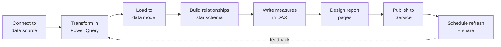

Two ideas are worth fixing in your head before the detail:

- **Work moves left to right, but you revisit.** You will go back to Power Query after you start modelling, and back to the model after you start writing DAX. That loop is normal, not a sign you did it wrong.
- **Fix problems as far left (upstream) as you can.** A wrong data type is cheapest to fix at the source, more expensive in Power Query, and most expensive once it is baked into DAX across twenty measures. The rest of this document keeps pushing work leftward for that reason.


## 2. Data sources

Power BI ships with connectors for well over a hundred sources. The ones below cover the great majority of real projects. For each, the question that matters is not "can Power BI read it" but "does it support **query folding** and **scheduled refresh** cleanly" — the two properties that decide whether a report stays fast and current. Query folding is covered in depth in [section 4.11](#411-query-folding).

### 2.1 The common connectors

| Source | Connector | Folding | Best for | Watch out for |
|--------|-----------|---------|----------|---------------|
| **Excel** | Excel workbook | No | Small reference data, manual inputs | Merged cells, formatting-as-data, sheets that move |
| **CSV / text** | Text/CSV | No | Exports, flat extracts | Encoding, delimiters, locale-dependent dates |
| **SQL Server** | SQL Server database | Yes | Enterprise transactional data | Use a read replica; avoid `SELECT *` |
| **PostgreSQL** | PostgreSQL database | Yes | Open-source OLTP, cloud DBs | Needs the Npgsql provider; SSL config |
| **MySQL / MariaDB** | MySQL database | Yes | Web-app back ends | Connector/NET dependency |
| **Azure SQL** | Azure SQL database | Yes | Cloud OLTP, DirectQuery | Firewall rules, DTUs under load |
| **REST APIs** | Web / `Web.Contents` | No | SaaS data, custom services | Pagination, auth tokens, rate limits |
| **SharePoint** | SharePoint folder / list | Partial | Team files, small lists | List view threshold (5,000 items) |
| **Web pages** | Web (HTML tables) | No | Public tables, scraping | Layout changes break the query |
| **Folder** | Folder | No | Many files with one shape | One bad file fails the whole combine |
| **JSON** | JSON | No | API responses, config, logs | Nested records/lists need expanding |
| **XML** | XML | No | Legacy feeds, config | Verbose; namespaces complicate parsing |

> [!TIP]
> "Folding: Yes" means Power Query can translate your transformation steps into the source's native query language (usually SQL) and let the source do the work. Databases fold; files and most APIs do not. Prefer a database over a file export whenever you have the choice — it is the single biggest lever on refresh speed.

### 2.2 Advantages and disadvantages, source by source

**Excel and CSV.** Easy for anyone to produce and open, need no infrastructure, and work well for small lookup tables (region names, targets, mappings). The cost is that they do not fold, they carry no schema so types drift, and a human can rename a column or move a sheet and silently break your refresh. Treat them as inputs of last resort for anything that grows.

**Relational databases (SQL Server, PostgreSQL, MySQL, MariaDB, Azure SQL).** These fold, enforce types, handle large volumes, and support both Import and DirectQuery. They are the right home for anything transactional. The trade-off is that you need credentials, network access, and — for scheduled refresh from the Service — a gateway if the database is on-premises. Point Power BI at a reporting replica or read-only user rather than the production write node.

**APIs and the Web connector.** Reach data that lives only in a SaaS product or a custom service. The downsides are real: no folding, so all filtering happens after the full pull; pagination and authentication you must handle in M; and rate limits that can throttle a refresh. Build a small, well-tested function to page through results and cache what you can.

**SharePoint, Folder, JSON, XML.** Useful connectors for their niches — team documents, drop-folders of identically shaped files, semi-structured feeds. Their shared weakness is fragility: SharePoint's list threshold, the folder combine breaking on one malformed file, deeply nested JSON needing careful expansion, and XML's verbosity. They repay defensive query design (see [section 5.5](#55-removing-errors)).

### 2.3 Choosing a source

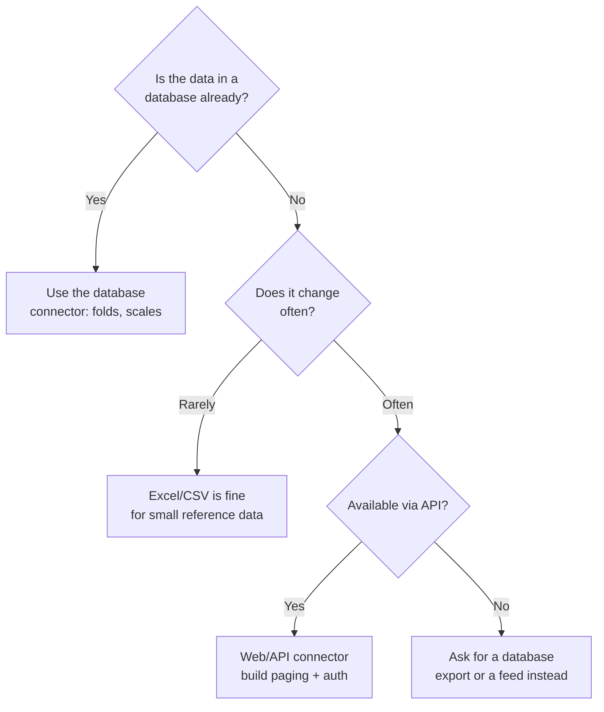

The practical rule: if the same data exists in both a file and a database, connect to the database. You gain folding, type safety, and a source that does not depend on someone remembering to run an export.


## 3. The ETL process

### 3.1 What ETL means here

ETL stands for **Extract, Transform, Load** — pull data out of a source, reshape it into the form your model needs, and load the result. In Power BI, the entire ETL layer is **Power Query**. Every "Get Data" click starts an extract; every step you add in the Power Query Editor is a transform; clicking **Close & Apply** performs the load into the VertiPaq model.

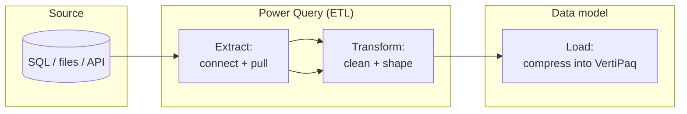

### 3.2 ETL vs ELT

The two differ only in *where the transform happens*.

| | ETL | ELT |
|---|-----|-----|
| Order | Extract → **Transform** → Load | Extract → Load → **Transform** |
| Transform runs on | The tool (Power Query engine) | The target system (database, warehouse) |
| Suits | Modest volumes, mixed sources | Large volumes, powerful warehouse |
| In Power BI | Default behaviour of Power Query | Achieved when steps **fold** back to SQL, or when you transform in the database/view first |

The line blurs in practice. When your Power Query steps fold, Power BI is doing something closer to ELT — the transform text is generated by the tool but *executed by the database*. When steps break folding (or the source is a file), it is pure ETL and the Power Query engine does the work on your refresh machine. This is why folding matters so much: it quietly turns ETL into the faster ELT pattern.

### 3.3 Power Query's role

Power Query is the only place in Power BI where you should change the *shape and content of incoming data* — splitting columns, filtering rows, fixing types, merging tables. Doing this work here (rather than later, in DAX) keeps the model small and the calculations simple.

A rough division of labour worth memorising:

- **Power Query** — row-level and column-level shaping that should happen once, at refresh: types, splits, merges, filters, cleaning.
- **The model** — relationships and structure.
- **DAX** — aggregation and business logic evaluated *at query time*, when a user interacts with a visual.

Keeping each concern in its own layer is what makes a report maintainable. The rest of the document is largely an expansion of that one sentence.


## 4. Power Query

Power Query is the ETL workspace. You reach it with **Transform data** on the Home ribbon (or **Get Data**, which opens it after you pick a source). Everything you click is recorded as a step in a small functional language called **M**; the UI is a friendly front end to that language.

### 4.1 Interface overview

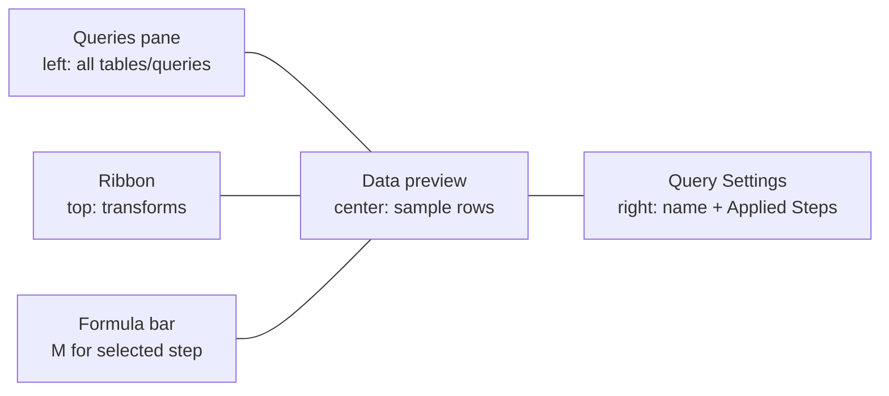

- **Queries pane (left).** Every query you have created — tables, reference queries, parameters, and functions. Group related queries into folders here.
- **Data preview (centre).** A sample of the current step's output. It is a *preview*, not the full data; large sources show only the first rows.
- **Query Settings (right).** The query name and the **Applied Steps** list.
- **Formula bar.** The M expression for the selected step. Turn it on with **View → Formula Bar** if it is hidden.

### 4.2 Query settings and applied steps

**Applied Steps** is the heart of Power Query. Each step is one transformation, recorded in order, and the query is simply those steps replayed top to bottom at every refresh. You can:

- Click any step to see the data *as of* that point.
- Rename steps (right-click → Rename) so the list reads like documentation — `Removed blank rows`, `Set order date type`, not `Filtered Rows1`, `Changed Type2`.
- Delete or reorder steps, and insert a new one between two existing ones.
- Click the gear icon on a step to reopen the dialog that created it.

> [!TIP]
> Rename your steps as you go. Six months later the difference between a query you can maintain and one you dread is whether the Applied Steps read like a sentence.

### 4.3 Data types

The small icon to the left of each column header is its data type. Types are not cosmetic — they drive storage size, sorting, relationships, and DAX behaviour.

| Icon | Type | Notes |
|------|------|-------|
| `123` | Whole number | Integers; smallest storage |
| `1.2` | Decimal number | Floating point; small rounding error possible |
| `$` | Fixed decimal (currency) | 4 decimal places, exact; use for money |
| `%` | Percentage | Stored as decimal |
| calendar | Date / Date-time / Time | Real temporal types, needed for time intelligence |
| `ABC` | Text | Highest cardinality; compresses worst |
| `T/F` | True/False | Boolean |
| `ABC 123` | Any | Untyped — avoid; forces guesses downstream |

> [!WARNING]
> Set types **explicitly** and **early**, and prefer to set them once near the top of your query. Two common traps: the auto-generated `Changed Type` step guesses from a sample and can guess wrong on later rows; and a text column that *looks* numeric ("00123", phone numbers) will lose leading zeros if you let Power Query coerce it. Decide the type on purpose.

Set a type by clicking the header icon, or in M:

```powerquery-m
= Table.TransformColumnTypes(
    Source,
    {
        {"OrderID", type text},
        {"OrderDate", type date},
        {"Amount", Currency.Type},
        {"Quantity", Int64.Type}
    }
)
```

### 4.4 Data profiling

Power Query can measure the quality of your data before you commit to it. Turn the tools on under the **View** tab. By default they sample the first 1,000 rows; switch to **Column profiling based on entire data set** in the status bar for the full picture (slower on large data).

The three tools:

- **Column quality** — the percentage of **valid**, **error**, and **empty** values per column. Your first check for nulls and type errors.
- **Column distribution** — a small bar chart of value frequency per column, plus **distinct** and **unique** counts. Reveals skew and unexpected repetition.
- **Column profile** — a detailed panel for one selected column: value counts, min/max, average, standard deviation, and the full distribution. Click a bar to filter to those rows.

> [!TIP]
> Use **distinct** vs **unique** to catch key problems fast. In a column that should be a primary key, distinct should equal the row count and unique should too. If unique is lower than distinct, you have duplicate keys — fix that before you build a relationship on the column.

### 4.5 Core transformations

The transforms below cover almost everything you do day to day. Each is one entry in Applied Steps.

| Transform | What it does | Typical use |
|-----------|--------------|-------------|
| **Rename** | Renames a column | Human-readable names for the model |
| **Remove columns** | Drops columns | Cut fields you will never use (smaller model) |
| **Choose columns** | Keeps only selected columns | Safer inverse of Remove — survives new source columns |
| **Split column** | One column into several | `FullName` → `First`, `Last`; by delimiter or position |
| **Merge columns** | Several columns into one | Build a key or an address line |
| **Replace values** | Swap one value for another | `"N/A"` → null; fix known typos |
| **Pivot column** | Rows → columns | Turn a category column into headers |
| **Unpivot columns** | Columns → rows | Turn month columns into `Month`/`Value` rows |
| **Group By** | Aggregate rows | Sum sales per customer; count per category |
| **Append** | Stack queries (union) | Combine Jan + Feb + Mar extracts |
| **Merge queries** | Join queries (lookup) | Bring in a customer's region from a dim table |
| **Conditional column** | Value from if/then rules | Band amounts into Low/Med/High |
| **Custom column** | Value from an M expression | Anything the UI does not cover |

#### Remove vs Choose columns

They reach the same result differently, and the difference matters for resilience. **Remove columns** records *"drop these named columns"* — if the source later adds a column, it flows straight through into your model. **Choose columns** records *"keep only these named columns"* — a new source column is ignored. For a stable, predictable model, **Choose columns** is usually the safer of the two.

#### Pivot and unpivot

These are inverses and they trip up almost everyone at first.

- **Unpivot** turns a wide table into a tall one. A table with `Jan`, `Feb`, `Mar` columns becomes rows of `Month` + `Value`. Models want tall, narrow tables, so unpivoting is the common direction.
- **Pivot** turns tall into wide, promoting the values in one column to become column headers.

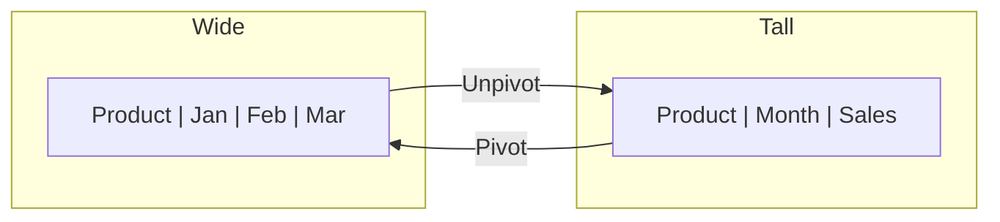

> [!TIP]
> Use **Unpivot Other Columns** rather than selecting the month columns directly. If a new month appears in the source, "unpivot other columns" adapts automatically, while a fixed selection breaks.

#### Append vs Merge

Two words that sound alike and do opposite things.

- **Append** stacks tables **vertically** — same columns, more rows. Use it to union period extracts or regional files into one table. It is SQL `UNION ALL`.
- **Merge** joins tables **horizontally** — matches rows on a key and brings columns across. It is SQL `JOIN`. Merge supports Left Outer, Right Outer, Full Outer, Inner, and the two Anti joins (rows in one table with no match in the other — excellent for finding orphans).

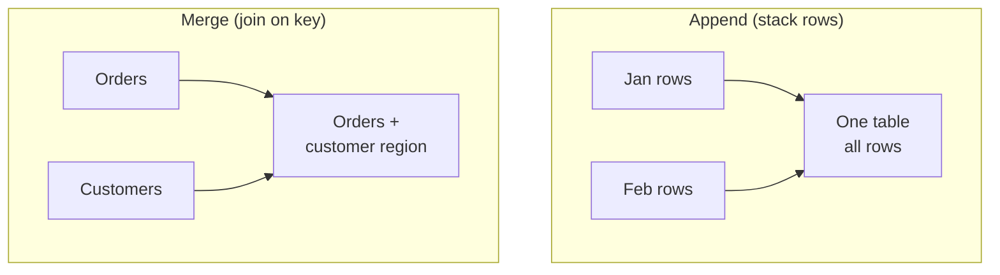

### 4.6 Conditional and custom columns

A **conditional column** builds a value from if/then/else rules through a dialog — good for banding or simple lookups. A **custom column** lets you write any M expression, which covers everything the dialogs do not.

```powerquery-m
// Custom column: profit margin, guarding against divide-by-zero
= if [Revenue] = 0 then null else ([Revenue] - [Cost]) / [Revenue]
```

> [!NOTE]
> Prefer Power Query custom columns to DAX calculated columns when the value is a fixed attribute of the row (a category, a cleaned string, a fiscal period). They compute once at refresh and compress like any source column. Reserve DAX for values that must react to filters at query time.

### 4.7 Duplicate vs Reference

Right-clicking a query offers both, and the distinction affects refresh and maintenance.

- **Duplicate** makes an independent copy of every step. The two queries share nothing afterward; editing one does not touch the other.
- **Reference** creates a new query that *starts from the output of* the original. Change the original and the reference sees the change.

**Reference** is the tool for a staging pattern: one base query does the shared cleaning, and several downstream queries reference it to branch into different tables. **Duplicate** suits a genuine fork where the two will diverge and you do not want a shared dependency.

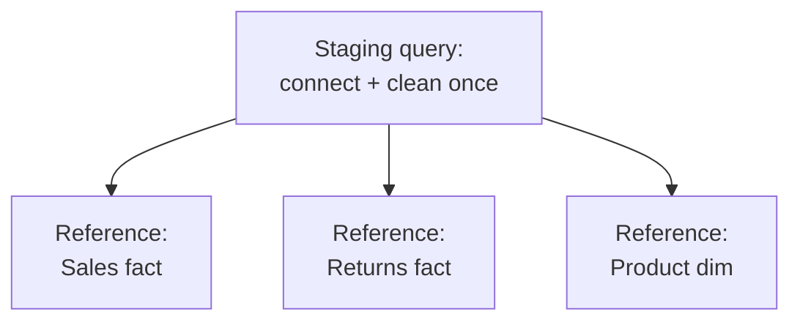

> [!WARNING]
> A reference does not automatically cache the base query's result. Depending on the source and privacy settings, referencing one base query from three others can re-run the base three times at refresh. If the base is expensive, consider staging it as a **dataflow** or enabling loading only where needed.

### 4.8 Parameters

A **parameter** is a named, typed value you can reuse and change in one place — a server name, a file path, a cut-off date, an environment switch. Create them under **Manage Parameters**.

Parameters earn their keep in three situations:

- **Environment promotion.** A `ServerName` parameter lets one `.pbix` point at Dev, Test, or Prod by changing a single value instead of editing every query.
- **Incremental refresh.** Power BI's incremental refresh feature *requires* two reserved date/time parameters, `RangeStart` and `RangeEnd`, to define the window it refreshes.
- **Reusable functions.** Parameters feed custom functions so one piece of logic serves many inputs.

```powerquery-m
// A query filtered by a RangeStart / RangeEnd parameter — the basis of incremental refresh
= Table.SelectRows(
    Source,
    each [OrderDate] >= RangeStart and [OrderDate] < RangeEnd
)
```

### 4.9 The M language

M (officially *Power Query Formula Language*) is the language every step compiles to. You do not have to write M — the UI writes most of it — but reading it makes you far more effective, and some jobs need it.

Key facts about M:

- **Case-sensitive.** `Table.SelectRows` works; `table.selectrows` does not. This surprises SQL and DAX users constantly.
- **Functional, not procedural.** A query is one big `let ... in` expression. Each line binds a name to the result of a step; the `in` clause names the step to return.
- **Everything is a value**, including tables, records, lists, and functions.

A whole query, written out:

```powerquery-m
let
    Source        = Sql.Database("server", "SalesDB"),
    Orders        = Source{[Schema="dbo", Item="Orders"]}[Data],
    RemovedCols   = Table.SelectColumns(Orders, {"OrderID","OrderDate","CustomerID","Amount"}),
    Typed         = Table.TransformColumnTypes(RemovedCols, {{"OrderDate", type date}, {"Amount", Currency.Type}}),
    Filtered      = Table.SelectRows(Typed, each [Amount] > 0)
in
    Filtered
```

Note the shape: each step refers to the previous one by name, so the pipeline reads top to bottom. Rename those step names and the query documents itself.

### 4.10 M data structures worth knowing

| Structure | Syntax | Example |
|-----------|--------|---------|
| List | `{ }` | `{1, 2, 3}`, `{"a".."z"}` |
| Record | `[ ]` | `[Name="Ada", Age=36]` |
| Table | `#table(...)` | built from columns + rows |

Access is positional for lists (`MyList{0}`), by field for records (`MyRecord[Name]`), and combined for tables (`Orders{0}[Amount]` — first row, Amount column). You will see this bracket-and-brace access in the auto-generated `Navigation` step of most database queries.

### 4.11 Query folding

**Query folding** is Power Query translating your steps into a single native query (usually SQL) that the *source* runs. Instead of pulling the whole table and filtering locally, Power BI sends `SELECT ... WHERE ...` and receives only the rows it needs.

Why it matters:

- **Less data crosses the wire** — the source filters and aggregates before sending.
- **The source does the heavy lifting** — databases are built for this and usually beat the Power Query engine.
- **Refresh is dramatically faster**, and incremental refresh depends on folding to work at all.

Check whether a step folds by right-clicking it and choosing **View Native Query**. If the option is available and shows SQL, everything up to that step folded. If it is greyed out, folding has stopped at or before that step.

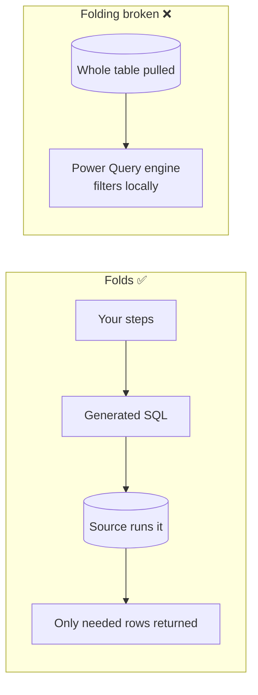

### 4.12 When folding breaks

Folding continues only while every step can be expressed in the source's query language. It stops — and stays stopped for all later steps — at operations the source cannot represent, including:

- Steps against a **non-foldable source** (Excel, CSV, most APIs) — these never fold.
- **Custom columns using M functions with no SQL equivalent** (many `Text.*`, some date math).
- **Merging with a non-foldable query**, or merging across different sources.
- Adding an **index column**, some **fuzzy** operations, and certain **pivot** patterns.
- Anything after you have already broken folding — order matters.

> [!TIP]
> Do foldable work **first**, non-foldable work **last**. Put your filters, column selection, and type changes at the top so they fold and shrink the data; push the custom columns and other engine-only steps to the bottom, where they operate on an already-small result.

### 4.13 Power Query performance tips

- **Filter early.** Remove rows and columns you do not need as the *first* steps so less data flows through everything after.
- **Keep folding alive** as far down the query as possible; use **View Native Query** to confirm.
- **Choose columns** instead of Remove where practical, so unexpected wide source tables cannot bloat your model.
- **Set types once**, deliberately, rather than letting several `Changed Type` steps accumulate.
- **Disable load** on staging and lookup queries you only reference (right-click → uncheck **Enable load**) so they do not become model tables.
- **Turn off background analysis** you do not need (Options → Data Load) — column profiling on entire data set and automatic type detection both cost time on big pulls.
- **Prefer database views** for complex joins; a view folds as one object and is easier to maintain than a long chain of merge steps.


## 5. Data cleaning

Cleaning is the part of Power Query aimed specifically at *correctness* rather than *shape*. Real source data arrives with duplicates, blanks, wrong types, errors, and inconsistent spellings. Each has a standard fix.

### 5.1 Removing duplicates

Select the key column(s) and use **Remove Rows → Remove Duplicates**. Power Query keeps the **first** occurrence it encounters, so the *order of rows before this step decides which duplicate survives*. If "which one wins" matters (keep the latest record per customer), sort first.

```powerquery-m
// Keep the most recent row per CustomerID
let
    Sorted  = Table.Sort(Source, {{"OrderDate", Order.Descending}}),
    Deduped = Table.Distinct(Sorted, {"CustomerID"})
in
    Deduped
```

> [!WARNING]
> Deduplicating a column you *think* is unique but is not will silently delete real data. Confirm with **Column distribution** (distinct vs unique counts) before you remove anything.

### 5.2 Handling nulls

There is no single right treatment — it depends on what the null means.

| Situation | Treatment |
|-----------|-----------|
| Missing measure that should be zero | **Replace Values** null → 0 |
| Missing text you want labelled | Replace null → `"Unknown"` |
| Row is unusable without the value | **Remove Rows → Remove Blank Rows**, or filter out nulls |
| Value carries down from a header row | **Fill Down** (common after unpivoting merged cells) |

> [!NOTE]
> Do not blanket-replace nulls with 0 in numeric columns without thinking. In DAX, `AVERAGE` ignores blanks but counts zeros, so turning "no reading" into 0 will drag an average down and change the answer. Blank and zero are different facts.

### 5.3 Fixing data types

Wrong types are the most common cause of broken relationships and failed measures. The fixes:

- Set the intended type **explicitly** on every column that matters.
- For dates, mind **locale**. A CSV with `03/04/2025` is 3 April or 4 March depending on region. Use **Using Locale** (right-click column → Change Type → Using Locale) to parse with the correct culture rather than the machine's default.
- Keep identifiers that are not arithmetic as **text** — order numbers, ZIP codes, account numbers. They never need summing and text preserves leading zeros.

### 5.4 Removing and replacing errors

An **error** is a cell where a step failed (a type conversion that could not complete, a divide-by-zero, a failed lookup). Errors are not the same as nulls and they will break loads if ignored.

- **Remove Errors** drops rows containing an error in the selected column.
- **Replace Errors** substitutes a chosen value.
- To *see* what is failing, use **Keep Errors** on a copy of the query and inspect the offending rows.

```powerquery-m
// Replace conversion errors in Amount with 0, then keep only clean rows elsewhere
= Table.ReplaceErrorValues(Source, {{"Amount", 0}})
```

### 5.5 Handling inconsistent values and standardizing formats

Free-text entry produces `Government`, `government`, `GOVERNMENT`, `Govt`, and `Gov` for one concept. Left alone, each becomes a separate value in slicers and a separate row in group-bys. Standardise:

- **Trim** and **Clean** to strip surrounding spaces and non-printing characters.
- **Capitalize Each Word** / **lowercase** / **UPPERCASE** to normalise case.
- **Replace Values** to fold known variants together (`"Govt"` → `"Government"`).
- For many-to-one mappings, build a small **mapping table** and **Merge** it in — far more maintainable than a stack of Replace steps.


> [!TIP]
> A mapping table (raw value → clean value) lives as data, so a non-developer can extend it, and it keeps your query readable. Prefer it to inline Replace steps once you have more than a handful of variants.


## 6. Data modelling

Modelling is where a set of loaded tables becomes a structure that answers questions quickly and correctly. Getting the model right is the highest-leverage work in Power BI: it fixes performance and correctness at the same time, and no amount of clever DAX rescues a bad model.

### 6.1 Fact tables and dimension tables

Every analytical model sorts its tables into two kinds.

- **Fact tables** record **events or measurements** — one row per sale, per transaction, per sensor reading. They are long (many rows), narrow (mostly keys and numeric measures), and grow over time. You aggregate them (sum, average, count).
- **Dimension tables** describe the **things involved** in those events — customers, products, dates, stores. They are shorter, wider (many descriptive attributes), and change slowly. You filter and group *by* them.

| | Fact table | Dimension table |
|---|-----------|-----------------|
| Grain | One event | One entity |
| Row count | High, growing | Low, stable |
| Typical columns | Keys + numeric measures | Descriptive attributes |
| You do this with it | Aggregate | Filter / group |
| Example | `Sales`, `Orders` | `Customer`, `Product`, `Date` |

### 6.2 Star schema

A **star schema** puts one fact table in the centre, connected to dimension tables around it, each by a single key. Drawn out, the dimensions radiate from the fact like points of a star.

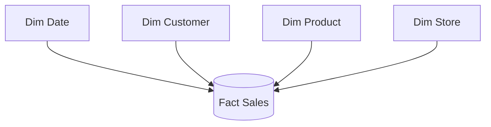

Filters flow **from** dimensions **into** the fact: pick a product in the Product dimension and the Sales fact filters to that product's rows. This one-directional flow is exactly what VertiPaq and DAX are optimised for.

### 6.3 Snowflake schema

A **snowflake** normalises dimensions into sub-dimensions: instead of one `Product` table, you have `Product → Subcategory → Category` as separate linked tables.

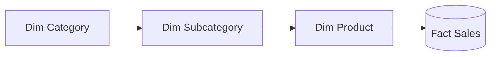

It saves a little storage and mirrors a normalised source, but it costs query performance (more relationships to traverse) and makes DAX and the field list more complex. In Power BI the usual advice is to **collapse a snowflake back into a star** by merging the sub-dimensions into one flat dimension table in Power Query.

### 6.4 Galaxy (constellation) schema

A **galaxy schema** (also called a fact constellation) has **multiple fact tables sharing conformed dimensions**. A `Sales` fact and a `Budget` fact might both connect to the same `Date` and `Product` dimensions.

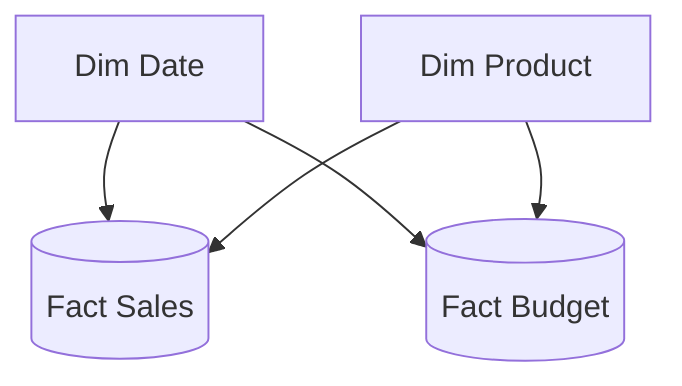

This is normal and correct for real models — most grow more than one fact table. The key requirement is **conformed dimensions**: both facts must relate to *the same* Date and Product tables, so a slicer filters both consistently. Do not build a separate date table per fact.

### 6.5 Normalized vs denormalized

- **Normalized** data spreads attributes across many linked tables to avoid repetition. It suits transactional databases, where write efficiency and integrity dominate.
- **Denormalized** data folds attributes together into fewer, wider tables. It suits analytics, where read speed dominates.

A star schema is a *deliberately denormalized* design: dimensions are flat and slightly redundant on purpose, because that shape reads fastest.

### 6.6 Why star schema is the recommendation

The star schema is the default for Power BI for concrete reasons, not convention:

1. **VertiPaq is built for it.** The engine compresses and scans a central fact plus flat dimensions extremely well.
2. **DAX assumes it.** Filter context flows dimension → fact naturally; time intelligence, `CALCULATE`, and cross-filtering all behave predictably.
3. **Fewer relationships to traverse** than a snowflake, so queries are faster.
4. **It is easier to read and extend.** Analysts find fields where they expect them, and adding a new fact reuses existing dimensions.

> [!TIP]
> When a model feels hard to write DAX against, the cause is usually the model, not the DAX. Reshaping toward a clean star fixes more problems than any formula rewrite.


## 7. Relationships

A **relationship** links two tables on a shared key so a filter on one propagates to the other. Relationships are what let a slicer on `Product` change a total that lives in `Sales`.

### 7.1 Relationship types by cardinality

| Type | Meaning | Example |
|------|---------|---------|
| **One-to-many (1:*)** | One row on the "one" side matches many on the "many" side | One `Product` → many `Sales` rows |
| **Many-to-one (*:1)** | The same relationship viewed from the many side | Many `Sales` → one `Product` |
| **One-to-one (1:1)** | Each row matches at most one row on the other side | `Employee` ↔ `EmployeeDetails` |
| **Many-to-many (*:*)** | Both sides can have repeats | `Accounts` ↔ `Customers` via joint accounts |

One-to-many (equivalently many-to-one — they are the same relationship named from opposite ends) is the backbone of a star schema: the dimension is the "one" side, the fact is the "many" side.

### 7.2 Active vs inactive relationships

Two tables can have more than one relationship, but only **one can be active** at a time. The active one (solid line in the model diagram) carries filters automatically. Additional relationships are **inactive** (dashed line) and lie dormant until a measure activates one with `USERELATIONSHIP`.

The classic case is **role-playing dates**. A `Sales` table has `OrderDate`, `ShipDate`, and `DueDate`, all pointing at one `Date` table. Only one relationship (say, `OrderDate`) is active; the others are inactive and switched on per measure:

```dax
Sales by Ship Date =
CALCULATE (
    [Total Sales],
    USERELATIONSHIP ( Sales[ShipDate], 'Date'[Date] )
)
```

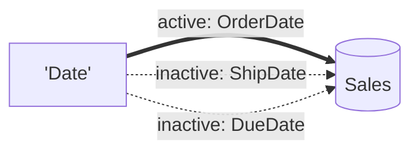

### 7.3 Cross-filter direction

Cross-filter direction controls **which way filters travel** across a relationship.

- **Single** — filters flow one way only, from the "one" side to the "many" side (dimension → fact). This is the default and the right choice for almost every relationship in a star schema.
- **Both (bidirectional)** — filters flow in both directions. Occasionally needed (for example, to filter a dimension by which values actually appear in the fact), but it introduces ambiguity, can create circular filter paths, and slows queries.

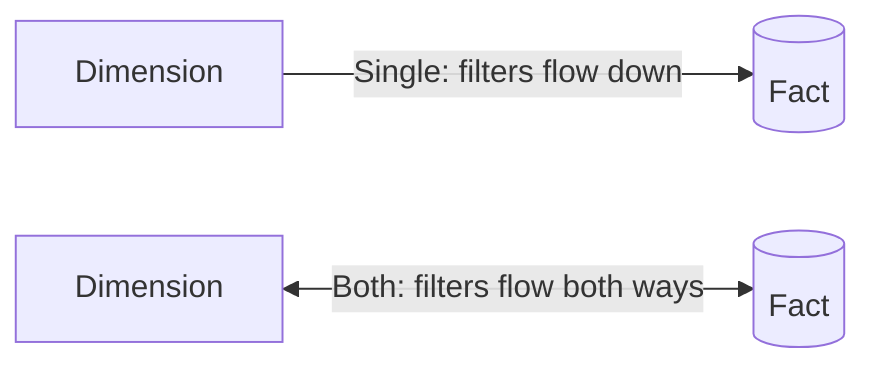

> [!WARNING]
> Reach for **Both** only when you have a specific reason and have ruled out the alternatives (a measure using `CROSSFILTER`, or a disconnected table). Bidirectional relationships are the most common source of subtle wrong-total bugs and of "ambiguous path" errors in larger models.

### 7.4 Troubleshooting relationships

| Symptom | Likely cause | Fix |
|---------|--------------|-----|
| Totals repeat the same number for every category | No active relationship, or filter direction wrong | Create/activate the relationship; check Single vs Both |
| "You can't create a relationship because one of the columns must have unique values" | The "one" side key is not unique | Deduplicate the dimension key, or fix the grain |
| A blank row appears in a dimension | Fact has key values not present in the dimension (referential integrity gap) | Add missing members to the dimension, or clean the fact |
| Numbers look right in some visuals, wrong in others | Ambiguous filter path from bidirectional relationships | Remove or narrow bidirectional filtering |
| Relationship line is dashed and does nothing | It is inactive | Activate it, or use `USERELATIONSHIP` in a measure |
| Cannot build the relationship at all | Mismatched data types on the two key columns | Align types in Power Query (both text, or both whole number) |


## 8. Cardinality

**Cardinality** has two related meanings in Power BI, and both matter.

### 8.1 Relationship cardinality

This is the 1:*, *:1, 1:1, or *:* label on a relationship — how many rows on each side can share a key value. Power BI detects it when you create the relationship, but it can guess wrong, and the wrong label changes results.

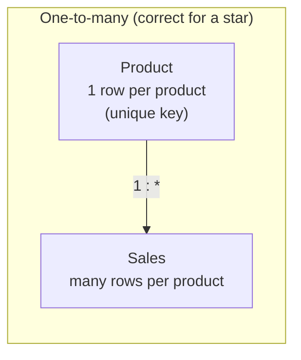

### 8.2 Column cardinality

This is the number of **distinct values** in a column. It is the single biggest driver of model size, because VertiPaq compresses low-cardinality columns extremely well and high-cardinality columns poorly.

| Column | Cardinality | Compresses |
|--------|-------------|------------|
| `Country` (≈200 values) | Low | Very well |
| `Order status` (5 values) | Very low | Excellent |
| `Customer ID` (millions) | High | Poorly |
| `Transaction timestamp` to the second | Very high | Worst — split it |

The practical consequences:

- **Split date-times.** A timestamp to the second has enormous cardinality. Split it into a `Date` column and a `Time` column and each compresses far better while staying just as usable.
- **Drop unused high-cardinality columns.** A GUID or a free-text note you never analyse can dominate your file size. Remove it in Power Query.
- **Round where precision is noise.** Storing 12 decimal places on a sensor reading multiplies distinct values for no analytical gain.

### 8.3 Why incorrect cardinality causes problems

**Wrong relationship cardinality** produces wrong numbers. If Power BI marks a genuine one-to-many relationship as one-to-one (because a sample looked unique), later duplicate keys will be dropped from filter propagation and totals will be understated — with no error message. If it marks a *:1 as *:*, filters may not propagate the way you expect. Always confirm the cardinality label matches reality, and make dimension keys genuinely unique.

**High column cardinality** produces slow, bloated models. It inflates the `.pbix`, slows refresh, and lengthens query time. Much of [section 14](#14-performance-optimization) is about driving cardinality down.

> [!TIP]
> If your file is surprisingly large, open **DAX Studio → VertiPaq Analyzer** (or the model's memory view). It ranks columns by the space they consume, which is almost always a ranking by cardinality. Attack the top of that list.


## 9. Measures vs calculated columns

Both are written in DAX, and choosing the wrong one is one of the most common — and most expensive — beginner mistakes. The distinction comes down to **when** each is calculated and **what context** it sees.

### 9.1 The core difference

| | Calculated column | Measure |
|---|-------------------|---------|
| Computed | At **refresh**, row by row | At **query time**, when a visual asks |
| Stored | Yes — occupies memory in the model | No — only the formula is stored |
| Sees | **Row context** (the current row) | **Filter context** (the current slice) |
| Result | One value per row | One value per filter context (per cell of a visual) |
| Use for | A fixed attribute of each row | An aggregation that reacts to filters |

### 9.2 When to use each

Use a **calculated column** when you need a per-row value that will be used to **slice, filter, group, or sit on an axis** — a category band, a fiscal period label, a concatenated key. And prefer to create these in **Power Query** instead, unless the logic genuinely needs the model (for instance, it references another table through a relationship with `RELATED`).

Use a **measure** for anything you **aggregate** — totals, averages, ratios, running totals, year-over-year. Measures respond to whatever the user has filtered, which is exactly what a report needs.

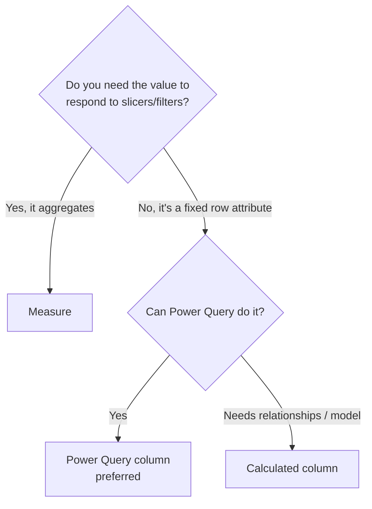

### 9.3 Performance implications

A calculated column is stored, so it **adds to model size** and, if high-cardinality, adds a lot. It also cannot respond to user filters — its value is frozen at refresh. A measure stores nothing and only runs when needed, so measures scale far better across a large model.

The frequent mistake is writing a calculated column like `Revenue = Quantity * Price` on a fact table with millions of rows. That materialises millions of values in memory. The right form is a measure:

```dax
Revenue = SUMX ( Sales, Sales[Quantity] * Sales[Price] )
```

`SUMX` computes `Quantity * Price` per row at query time and sums the result, storing nothing and respecting every filter the user applies.

> [!TIP]
> Default to a measure. Only reach for a calculated column when you specifically need a stored, filterable, per-row value — and even then, ask whether Power Query should own it instead.


## 10. DAX

**DAX** (Data Analysis Expressions) is the formula language for measures and calculated columns. It looks like Excel formulas at a glance and behaves very differently underneath, because it operates on whole tables and columns under a system of *evaluation contexts*.

### 10.1 The mental model: evaluation contexts

Almost every DAX bug is a context bug. Two contexts govern every calculation.

- **Row context** — "the current row." It exists automatically inside a calculated column and inside iterator functions (`SUMX`, `FILTER`, and the other `X` functions). It does *not* automatically let you reference other tables — that needs a relationship and `RELATED`.
- **Filter context** — "the current slice." It is the set of filters applied by slicers, rows and columns of a visual, and `CALCULATE`. A measure evaluates once per filter context — once per cell in a matrix, once per point on a line.

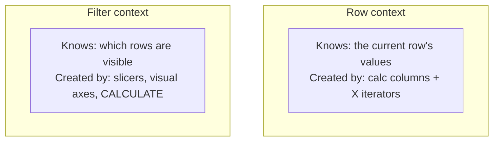

**Context transition** is the bridge between them: when `CALCULATE` (or a measure referenced inside a row context) runs, the current row context is turned *into* an equivalent filter context. This single mechanism explains most "why is my total wrong" surprises, and it is why `CALCULATE` is the most important function in the language.

### 10.2 Common functions by family

#### Aggregations

```dax
Total Sales   = SUM ( Sales[Amount] )
Order Count   = COUNTROWS ( Sales )
Avg Price     = AVERAGE ( Sales[Price] )
Distinct Cust = DISTINCTCOUNT ( Sales[CustomerID] )
```

#### Iterators (the "X" functions)

Iterators walk a table row by row (row context) and aggregate an expression. Use them when the calculation must happen per row before aggregating.

```dax
Revenue       = SUMX ( Sales, Sales[Quantity] * Sales[Price] )
Avg Line Value= AVERAGEX ( Sales, Sales[Quantity] * Sales[Price] )
Max Order     = MAXX ( Sales, Sales[Quantity] * Sales[Price] )
```

#### Logical

```dax
Margin Band =
SWITCH ( TRUE (),
    [Margin] < 0.1, "Low",
    [Margin] < 0.3, "Medium",
    "High"
)
```

`SWITCH(TRUE(), ...)` is the idiomatic way to write a multi-branch condition; it reads better than nested `IF`.

#### Filter functions

These are the heart of DAX. They modify filter context.

| Function | Does |
|----------|------|
| `CALCULATE` | Evaluates an expression under modified filters — the key function |
| `FILTER` | Returns a table filtered by a condition (row-by-row) |
| `ALL` | Removes filters from a column or table |
| `REMOVEFILTERS` | Same intent as `ALL`, clearer name (modern syntax) |
| `ALLEXCEPT` | Removes all filters except the listed columns |
| `VALUES` | Distinct values currently visible in a column |
| `DISTINCT` | Distinct values, excluding a blank added by relationships |
| `KEEPFILTERS` | Adds a filter without overwriting existing ones |

#### Relationship navigation

- `RELATED` — pulls a value from the **one** side into a row context on the **many** side (fact → dimension lookup). Scalar, one value.
- `RELATEDTABLE` — returns the related rows from the **many** side for a row on the **one** side. A table.

```dax
// On a Sales row, fetch the product's category from the Product dimension
Product Category = RELATED ( Product[Category] )

// On a Product row, count that product's sales
Sales Per Product = COUNTROWS ( RELATEDTABLE ( Sales ) )
```

### 10.3 CALCULATE in depth

`CALCULATE ( <expression>, <filter1>, <filter2>, ... )` evaluates the expression after applying (or removing) the filters you pass. Two idioms cover most uses:

```dax
-- Sales for one category, ignoring any category filter the user set
Furniture Sales =
CALCULATE ( [Total Sales], Product[Category] = "Furniture" )

-- Percent of grand total: numerator in context, denominator with the category filter removed
% of Total =
DIVIDE (
    [Total Sales],
    CALCULATE ( [Total Sales], REMOVEFILTERS ( Product[Category] ) )
)
```

`CALCULATE` also performs **context transition**, which is why referencing a measure inside `SUMX` behaves as though you wrapped it in `CALCULATE`.

### 10.4 Variables

Variables (`VAR ... RETURN`) make DAX readable and faster. A variable is evaluated **once**, where it is defined, and reused — so it avoids recomputing the same sub-expression and it "freezes" a value before the filter context changes.

```dax
YoY % =
VAR CurrentSales  = [Total Sales]
VAR PriorSales    = CALCULATE ( [Total Sales], SAMEPERIODLASTYEAR ( 'Date'[Date] ) )
VAR Delta         = CurrentSales - PriorSales
RETURN
    DIVIDE ( Delta, PriorSales )
```

> [!TIP]
> Reach for variables early. They cut duplication, make intent obvious, and sidestep a whole class of context bugs where a value you expected to be "the current total" quietly changes after a `CALCULATE`.

### 10.5 Time intelligence

Time-intelligence functions compare periods — year-to-date, prior year, running totals. They **require a proper date table** marked as a date table (see [section 11](#11-date-tables)).

```dax
Sales YTD  = TOTALYTD ( [Total Sales], 'Date'[Date] )
Sales PY   = CALCULATE ( [Total Sales], SAMEPERIODLASTYEAR ( 'Date'[Date] ) )
Sales MTD  = TOTALMTD ( [Total Sales], 'Date'[Date] )
Rolling 3M =
CALCULATE (
    [Total Sales],
    DATESINPERIOD ( 'Date'[Date], MAX ( 'Date'[Date] ), -3, MONTH )
)
```

### 10.6 DAX best practices

- **Always use `DIVIDE`** for ratios, never `/`. `DIVIDE` returns blank (or a value you choose) on divide-by-zero instead of an error.
- **Reference measures, not raw columns**, inside other measures — it keeps logic in one place.
- **Format with variables** and clear names; DAX is read far more than it is written.
- **Avoid `FILTER` over a whole large table** when a simple boolean predicate in `CALCULATE` folds better. Use `FILTER` when the condition genuinely needs row-by-row evaluation.
- **Prefer `REMOVEFILTERS`/`KEEPFILTERS`** (modern, explicit) to bare `ALL` where clarity helps.
- **Do not put business logic in calculated columns** that a measure should own (see [section 9](#9-measures-vs-calculated-columns)).


## 11. Date tables

### 11.1 Why they matter

Time intelligence does not work reliably without a dedicated date table. The reasons:

- Functions like `TOTALYTD` and `SAMEPERIODLASTYEAR` need a **continuous, gap-free** column of dates. Your fact table's dates have gaps (no sales on some days), which breaks the maths.
- A separate date table gives you attributes to slice by — year, quarter, month name, fiscal period, weekday, holiday flags — that the fact table does not carry.
- One conformed date table lets **every** fact (sales, budget, returns) be sliced by the same calendar, which is what a galaxy schema needs.

### 11.2 Creating a date table

The cleanest option is DAX with `CALENDAR` (or `CALENDARAUTO`), building attributes as columns:

```dax
Date =
ADDCOLUMNS (
    CALENDAR ( DATE ( 2022, 1, 1 ), DATE ( 2026, 12, 31 ) ),
    "Year",        YEAR ( [Date] ),
    "Month No",    MONTH ( [Date] ),
    "Month",       FORMAT ( [Date], "MMM" ),
    "Quarter",     "Q" & FORMAT ( [Date], "Q" ),
    "Year Month",  FORMAT ( [Date], "YYYY-MM" ),
    "Weekday",     FORMAT ( [Date], "ddd" ),
    "Is Weekend",  WEEKDAY ( [Date], 2 ) > 5
)
```

You can equally build the table in Power Query, which keeps it foldable and out of the model's calculation layer — a good choice for large or enterprise models.

> [!NOTE]
> Set the range to cover **every date your facts might contain**, past and future. A date table that stops before your latest order will drop those orders from time-intelligence results.

### 11.3 Mark as date table

After creating the table, right-click it → **Mark as date table**, and choose the date column. This tells Power BI the table is *the* calendar, which:

- Enables the built-in time-intelligence functions to behave correctly.
- Applies the correct "remove all date filters" behaviour internally.
- Lets you sort `Month` by `Month No` so months order Jan→Dec, not alphabetically.

> [!TIP]
> Set **Sort by column** on your text date attributes: sort `Month` by `Month No`, `Month Year` by a `YYYYMM` integer. Otherwise slicers list months and periods alphabetically, which confuses everyone.

### 11.4 Fiscal calendars

If the business year does not start in January, add fiscal columns (fiscal year, fiscal quarter, fiscal month number) so slicers and time intelligence align to the real reporting calendar. Build the offset once in the date table and every measure inherits it.


## 12. Report design

A correct model still needs a report people can read. Design decisions here are about getting the reader to the answer with the least effort.

### 12.1 Layout and visual hierarchy

Readers scan a page in a **Z or F pattern**, starting top-left. Put the headline number or the most important visual where the eye lands first, and arrange the rest in decreasing importance.

- **Top-left:** the single number or KPI that summarises the page.
- **Across the top:** supporting KPIs and the primary trend.
- **Middle and lower:** detail, breakdowns, and tables for people who want to dig.
- **Slicers:** grouped together, usually top or left, so filters are found in one place.

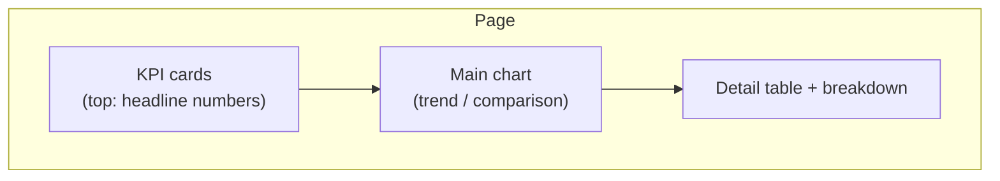

### 12.2 Alignment and spacing

Snap visuals to a grid so edges line up. Misaligned visuals read as sloppy even when the content is right. Use the alignment tools (Format → Align, Distribute) and keep consistent gutters between visuals. Give the page room to breathe — cramming twelve visuals onto one page usually means it should be two pages.

### 12.3 Colour selection

- **Use colour to carry meaning, not decoration.** One accent colour for the metric that matters, muted greys for context. When every series is a bright colour, none stands out.
- **Stay consistent:** the same category should be the same colour on every page.
- **Follow convention** where it exists — red for bad, green for good in a Western business audience (but see accessibility below).
- **Limit the palette.** Three or four colours plus neutrals is plenty for most reports.

### 12.4 Themes

A **theme** is a JSON file (or built-in preset) that sets default colours, fonts, and visual styling across the whole report. Apply one under **View → Themes**. A theme keeps every page consistent and lets you restyle the report by swapping one file rather than editing every visual. Build a corporate theme once and reuse it across reports.

### 12.5 Accessibility

Accessibility is a requirement in many organisations and good practice everywhere.

- **Do not rely on colour alone.** Around 1 in 12 men has some colour-vision deficiency; pair colour with labels, icons, or position so the message survives in greyscale.
- **Check contrast** between text and background (aim for the WCAG AA ratio).
- **Set tab order** (Selection pane → Tab order) so keyboard and screen-reader users move through visuals sensibly.
- **Add alt text** to visuals so screen readers can describe them.
- **Label directly** where you can, instead of forcing readers back to a legend.


## 13. Visualizations

Choosing the right visual is choosing the right *comparison*. The table below groups the major visuals by the question they answer; the notes after it cover the ones with traps.

### 13.1 The visual catalogue

| Visual | Answers | Good when | Avoid when |
|--------|---------|-----------|------------|
| **Table** | "What are the exact values?" | Precise lookup, many columns | You want a pattern, not numbers |
| **Matrix** | "Values across two dimensions?" | Cross-tabs, row/column groups, drill | Only one dimension (use a table) |
| **Card** | "One number, big" | A single headline KPI | You need context/trend |
| **KPI** | "Value vs target vs trend" | Progress against a goal | No meaningful target |
| **Gauge** | "Progress within a range" | Single value vs min/max/target | Comparing many items |
| **Column (vertical bar)** | "Compare across categories" | Few categories, time on X | Many long category labels |
| **Bar (horizontal)** | "Compare across categories" | Long labels, ranking | Time series (use column/line) |
| **Line** | "Trend over time" | Continuous time, multiple series | Unordered categories |
| **Area** | "Trend + magnitude" | Cumulative totals over time | Many overlapping series |
| **Stacked column/bar** | "Parts of a whole over categories" | Composition + total | Comparing the inner segments precisely |
| **Pie / Donut** | "Share of a whole" | 2–4 slices, one point in time | More than ~5 slices, comparisons |
| **Scatter** | "Relationship between two measures" | Correlation, outliers | Categorical data |
| **Treemap** | "Hierarchical share by area" | Many categories, rough proportion | Precise comparison |
| **Map / Filled map** | "Where, geographically" | Real location data | Non-spatial "regions" |
| **Ribbon** | "Rank changes over time" | Who's on top each period | Exact values matter |
| **Waterfall** | "What drove the change?" | Bridge from start to end value | No clear increments |
| **Funnel** | "Drop-off through stages" | Pipelines, conversion | Non-sequential data |
| **Decomposition tree** | "Why? break it down" | Ad-hoc root-cause exploration | Fixed, printed reports |
| **Key influencers** | "What drives this metric?" | Finding factors behind an outcome | Small data, no real drivers |

### 13.2 Visuals that need a warning

**Pie and donut charts.** People judge angles poorly. Beyond about four slices they become unreadable, and they are hopeless for comparing two similar values. A bar chart almost always communicates share better. Keep pies for the rare case of two or three parts of an obvious whole.

**3D and dual-axis charts.** 3D distorts the very comparison it is meant to show; Power BI wisely omits 3D column charts. A secondary axis (two different scales on one chart) invites misreading — use it sparingly and label both axes clearly.

**Stacked charts for inner comparison.** A stacked bar shows the total and the bottom segment well, but the middle segments float on uneven baselines and cannot be compared by eye. If the inner parts are the point, use clustered bars or small multiples.

### 13.3 Interaction features

These turn a static page into an explorable one.

- **Slicers** — on-canvas filters (dropdown, list, between, relative date). Group them and set their interactions deliberately.
- **Bookmarks** — save a report state (filters, visibility, selection). Drive navigation, show/hide panels, and build guided stories or a "reset filters" button.
- **Tooltips** — the hover pop-up. Replace the default with a **report-page tooltip** to show a mini-chart on hover without cluttering the page.
- **Drillthrough** — right-click a data point to jump to a detail page filtered to that point (a customer, a product) — keeps the summary clean while detail stays one click away.
- **Drill down** — step through a hierarchy (Year → Quarter → Month) inside one visual.
- **Cross-highlighting** — clicking a bar in one visual highlights the related parts of the others; it is on by default and can be tuned under **Format → Edit interactions**.

> [!TIP]
> Design the summary page for the 80% who want the headline, and use drillthrough and tooltips for the 20% who want detail. Trying to satisfy both on one crowded page satisfies neither.


## 14. Performance optimization

Performance work in Power BI is mostly *model* work. A lean star schema with the right data types outruns a bloated model on faster hardware every time. Tackle the items below roughly in order of payoff.

### 14.1 Reduce model size

Model size drives refresh time, query time, and how much the Service has to hold in memory.

- **Remove columns you do not use.** The cheapest win. Every column costs storage even if no visual references it.
- **Lower cardinality** (see [section 8.2](#82-column-cardinality)): split timestamps into date + time, round noisy decimals, drop GUIDs and free-text you never analyse.
- **Prefer measures to calculated columns**, so values are computed at query time rather than stored.
- **Import only the rows you need** — filter to the relevant date range and entities at the source, not after loading.

### 14.2 Disable auto date/time

Power BI silently creates a hidden date table for **every** date column in the model when Auto Date/Time is on. On a model with many date columns this can add substantial hidden bloat. Turn it off under **File → Options → Data Load → Time Intelligence**, and use your own marked date table instead.

> [!WARNING]
> Auto Date/Time is on by default and its cost is invisible in the field list. On large models it is one of the biggest hidden size sinks. Disable it and rely on a single, proper date table.

### 14.3 Query reduction and visual optimization

- **Fewer visuals per page.** Every visual issues its own query on load; twenty visuals mean twenty queries. Split dense pages.
- **Turn on Query Reduction** (Options → Query Reduction) to add an **Apply** button to slicers, so the model refreshes once after the user finishes choosing rather than on every click.
- **Avoid overly complex measures on high-cardinality axes** — a heavy measure evaluated per row of a large table is slow.
- **Limit visuals that return many rows** (huge tables); page or aggregate instead.

### 14.4 Aggregations

For very large fact tables, build **aggregation tables** — pre-summarised copies at a coarser grain (daily totals per product, say). Power BI's aggregation feature routes a query to the small aggregate when the detail is not needed and falls back to the fact table when it is. Users get sub-second summaries and full detail on demand.

### 14.5 Incremental refresh

Instead of reloading the entire history every refresh, **incremental refresh** reloads only a recent window (for example, the last few days) and keeps older partitions untouched. It requires the `RangeStart` / `RangeEnd` parameters ([section 4.8](#48-parameters)) and a foldable source. The result is refreshes measured in seconds rather than hours on large tables.

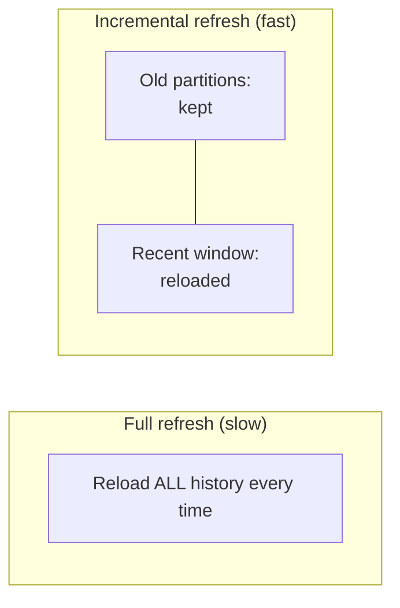

### 14.6 Star schema optimization

Everything above compounds when the model is a clean star. Collapse snowflakes into flat dimensions, keep relationships single-direction, make dimension keys unique and low-cardinality, and let the fact table hold keys and measures only. The payoff is not only tidiness: the star is the shape VertiPaq and DAX run fastest against, so the same design that reads clearly also queries quickly.

### 14.7 Tools for finding the bottleneck

- **Performance Analyzer** (View → Performance Analyzer) times every visual's query and render on a page. Start here to find the slow visual.
- **DAX Studio** with **VertiPaq Analyzer** shows column-by-column memory use and lets you profile query plans.
- **View Native Query** in Power Query confirms whether refresh work is folding to the source.


## 15. Publishing and the Power BI Service

Authoring happens in Desktop; everything after — sharing, scheduled refresh, governance — happens in the **Power BI Service** (or Report Server).

### 15.1 Publishing a report

Click **Publish** in Desktop and choose a destination workspace. This uploads two linked objects: the **semantic model** (formerly "dataset" — the queries, model, and measures) and the **report** (the pages of visuals). Republishing overwrites both; the model keeps its configured refresh schedule and credentials.

### 15.2 Workspaces

A **workspace** is a container for related content and the unit of collaboration and permissions.

- Develop and test in a workspace with your team as members.
- Assign workspace **roles** — Admin, Member, Contributor, Viewer — to control who can edit versus only view.
- Keep separate workspaces (or use deployment pipelines) for Dev, Test, and Production rather than editing live content.

### 15.3 Apps

An **app** is a curated, read-only package published *from* a workspace for a wide audience. Consumers get a clean set of reports without seeing the workspace's work-in-progress, and you control exactly which items and audiences are included. Apps are the standard way to distribute to many viewers.


### 15.4 Gateways

When a **scheduled refresh** in the cloud needs data that lives **on-premises** (or in a private network), an **on-premises data gateway** bridges the two. The Service sends the refresh request to the gateway; the gateway queries the local source and returns the data over an encrypted channel.

- Use the **standard (enterprise) gateway** for shared, production refresh — installed on a server, managed centrally.
- **Personal mode** suits a single analyst's own refreshes and should not anchor shared content.
- Cloud-only sources (Azure SQL, a cloud PostgreSQL like Aiven) generally do **not** need a gateway.

### 15.5 Refresh schedules

For **Import** models, data is only as fresh as the last refresh. Configure a schedule on the semantic model (Settings → Scheduled refresh): set the times, the time zone, and failure notifications. Match the frequency to how fast the data actually changes and to the refresh limits of your licence tier.

### 15.6 Permissions and deployment

- **Permissions** combine workspace roles, app audiences, per-item sharing, and (for data) row-level security. Grant the least access that does the job.
- **Deployment pipelines** (Premium/Fabric) move content Dev → Test → Prod with rules that swap data sources per stage — safer than manual re-publishing.
- **Version control:** `.pbix` is a binary and does not diff well in Git. Save developer copies deliberately, and for team development use the newer **PBIP (Power BI Project)** format, which stores the model and report as text files that *do* version-control cleanly.

> [!TIP]
> Treat Production as read-only. Make changes in Dev, promote through Test, and let a pipeline (or a disciplined manual process) push to Prod. Editing live reports is how "it worked yesterday" incidents happen.


## 16. Security

Power BI layers several controls; they combine rather than replace each other.

### 16.1 Row-level security (RLS)

RLS restricts **which rows** a user can see within the same report. You define **roles** with DAX filter rules on tables, then assign users or groups to roles in the Service.

```dax
-- Role "Regional Manager": each user sees only their own region
[Region] = USERPRINCIPALNAME ()
```

More often you map users to regions through a security table and filter with a relationship, so one role serves everyone:

```dax
-- On a UserRegion mapping table
[UserEmail] = USERPRINCIPALNAME ()
```

Test roles with **View as** in Desktop before publishing.

```mermaid
flowchart TD
    U[User signs in] --> R{Which RLS role?}
    R -->|East| E[Sees East rows only]
    R -->|West| W[Sees West rows only]
    R -->|Admin role, no filter| A[Sees all rows]
```

### 16.2 Object-level security (OLS)

OLS hides **entire tables or columns** from certain roles — not just rows. Use it when the *existence* of a field (salaries, say) should be invisible to some users. OLS is configured with external tooling (Tabular Editor) and assigned to the same roles as RLS.

### 16.3 Workspace permissions and sharing

Control edit-versus-view through workspace roles and app audiences (see [section 15](#15-publishing-and-the-power-bi-service)). Prefer granting access to **security groups** over individuals — it scales and it survives staff changes.

### 16.4 Sensitivity labels

**Sensitivity labels** (from Microsoft Purview) classify content — Public, Confidential, Highly Confidential — and can enforce encryption and access rules that **travel with exported files** (to Excel, PDF, PowerPoint). They give governance teams a consistent classification across Microsoft 365 and Power BI.

> [!WARNING]
> RLS filters data but does **not** obfuscate measure logic or hide table structure — a determined user with the wrong access could still infer values. For truly sensitive fields, combine RLS with OLS, least-privilege sharing, and sensitivity labels rather than relying on any one control.


## 17. Common problems and how to fix them

| Problem | Usual cause | Fix |
|---------|-------------|-----|
| **Relationship errors** ("column must have unique values") | The "one"-side key is not unique, or key types mismatch | Deduplicate the dimension key; align both key columns to the same type |
| **Circular dependency** | Calculated columns/measures reference each other in a loop, or bidirectional relationships form a cycle | Break the loop; move logic to a measure; remove a bidirectional filter |
| **Refresh failure in the Service** | Missing/expired credentials, no gateway for on-prem source, a source change, timeout | Re-enter credentials; configure/verify the gateway; check source availability and query limits |
| **Out-of-memory / model too large** | High-cardinality columns, unused columns, Auto Date/Time, importing full history | Drop columns, lower cardinality, disable Auto Date/Time, use incremental refresh |
| **Slow report** | Too many visuals, heavy measures, non-star model, no folding at refresh | Performance Analyzer to find the visual; simplify measures; reshape to a star; restore folding |
| **Duplicate values inflating totals** | Fan-out from a wrong-grain join, or a non-unique key on the "one" side | Fix the join grain; make the dimension key unique; check cardinality label |
| **Blank member in a slicer** | Fact keys with no match in the dimension | Add missing dimension members, or clean the fact keys |
| **Broken visual after a rename** | A field a visual used was renamed or removed in the model | Restore the field or repoint the visual; rename in the model, not ad hoc |
| **Wrong dates / off-by-a-month** | Locale mis-parsing a text date at import | Re-import with **Change Type → Using Locale** |
| **Totals don't match a detail sum** | Measure evaluated in the total's context differs from row context (normal DAX behaviour) | Re-express the measure (often an iterator) so the total aggregates rows correctly |

> [!TIP]
> When a number is wrong, isolate the layer before you guess. Check the raw rows in Power Query, then the relationship in model view, then the measure with a simple test visual. Most "DAX is broken" reports turn out to be a modelling or data-type issue upstream.


## 18. Best practices checklist

Run through this before you publish anything you will be judged on.

**Data sources and Power Query**
- [ ] Connected to the most authoritative source (database over file where possible)
- [ ] Filtered rows and columns as the *first* steps
- [ ] Confirmed folding with **View Native Query** where the source supports it
- [ ] Set every data type explicitly and early; dates parsed with correct locale
- [ ] Renamed Applied Steps so the query reads like documentation
- [ ] Disabled load on staging/lookup-only queries

**Model**
- [ ] Star schema; snowflakes collapsed into flat dimensions
- [ ] One conformed date table, **Mark as date table** applied
- [ ] Auto Date/Time turned off
- [ ] Relationships single-direction unless a specific need justifies Both
- [ ] Dimension keys unique and low-cardinality; cardinality labels verified
- [ ] Removed unused and high-cardinality columns; split timestamps

**DAX**
- [ ] Aggregations are measures, not calculated columns
- [ ] Ratios use `DIVIDE`
- [ ] Variables used for clarity and to avoid recomputation
- [ ] Measures reference other measures, not repeated raw logic
- [ ] Time intelligence built on the marked date table

**Report**
- [ ] Consistent theme; limited, meaningful colour palette
- [ ] Most important number top-left; visuals aligned to a grid
- [ ] Right visual for each comparison (no pies with ten slices)
- [ ] Accessibility: contrast, tab order, alt text, not colour-alone
- [ ] Drillthrough/tooltips for detail instead of one crowded page

**Publish and secure**
- [ ] Published to the correct workspace; app curated for viewers
- [ ] Refresh scheduled; gateway configured for on-prem sources
- [ ] RLS/OLS defined and tested with **View as**
- [ ] Access granted to security groups with least privilege
- [ ] Version saved (PBIP for team development)


## 19. Appendix

### 19.1 Glossary

| Term | Meaning |
|------|---------|
| **VertiPaq** | The in-memory columnar engine that stores and compresses the model |
| **Semantic model** | The queries + model + measures (formerly "dataset") |
| **M** | Power Query's transformation language |
| **DAX** | The formula language for measures and calculated columns |
| **Query folding** | Translating Power Query steps into the source's native query |
| **Fact table** | Table of events/measurements; you aggregate it |
| **Dimension table** | Table of descriptive attributes; you filter/group by it |
| **Star schema** | Central fact + surrounding flat dimensions |
| **Cardinality** | Distinct values in a column, or the 1:*/*:1 label on a relationship |
| **Row context** | "The current row" — in calc columns and iterators |
| **Filter context** | "The current slice" — from slicers, axes, and `CALCULATE` |
| **Context transition** | Turning row context into filter context (via `CALCULATE`) |
| **RLS / OLS** | Row-level / object-level security |
| **Gateway** | Service that lets the cloud reach on-premises data |
| **Incremental refresh** | Refreshing only a recent window instead of full history |

### 19.2 Keyboard shortcuts (Desktop)

| Shortcut | Action |
|----------|--------|
| `Ctrl` + `C` / `V` | Copy / paste a visual |
| `Ctrl` + `Z` / `Y` | Undo / redo |
| `Ctrl` + `S` | Save |
| `Ctrl` + click | Multi-select visuals or data points |
| `Alt` + drag | Temporarily suspend snap-to-grid |
| `F11` | Toggle focus (full-screen) mode |
| `Ctrl` + `Shift` + `Enter` | Table/matrix: see the underlying data |
| `Esc` | Clear a selection / close a dialog |

In the **DAX/Power Query formula bar**: `Alt` + `Enter` adds a line break, and `Ctrl` + `Space` triggers IntelliSense.

### 19.3 Useful Microsoft documentation

- Power BI documentation home — https://learn.microsoft.com/power-bi/
- DAX function reference — https://learn.microsoft.com/dax/
- Power Query M reference — https://learn.microsoft.com/powerquery-m/
- Star schema guidance — https://learn.microsoft.com/power-bi/guidance/star-schema
- Query folding guidance — https://learn.microsoft.com/power-query/query-folding-basics
- Row-level security — https://learn.microsoft.com/power-bi/enterprise/service-admin-rls
- Incremental refresh — https://learn.microsoft.com/power-bi/connect-data/incremental-refresh-overview

### 19.4 Recommended learning resources

- **SQLBI** (Marco Russo, Alberto Ferrari) — the definitive DAX and modelling material; *The Definitive Guide to DAX*.
- **DAX Studio** — free tool for query profiling and VertiPaq analysis; https://daxstudio.org/
- **Tabular Editor** — model editing, OLS, best-practice analyzer; https://tabulareditor.com/
- **Microsoft Learn training paths** for Power BI (free, structured, with the PL-300 certification as a goal).
- **Power BI community forums** — https://community.fabric.microsoft.com/ for specific problems.

